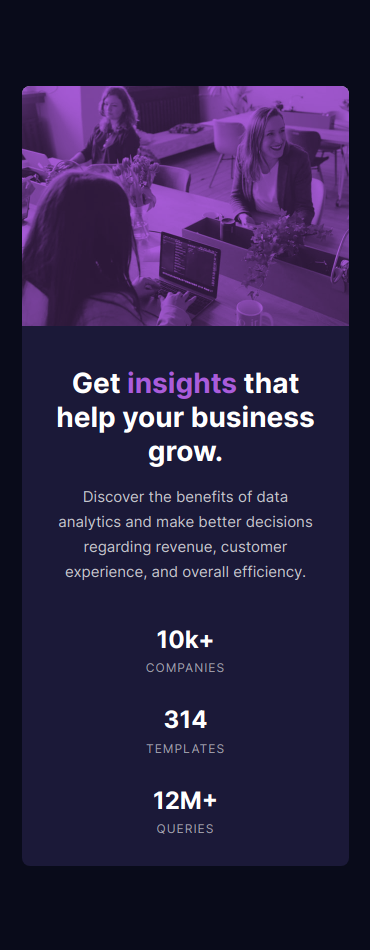

# Frontend Mentor - Stats preview card component solution

This is a solution to the [Stats preview card component challenge on Frontend Mentor](https://www.frontendmentor.io/challenges/stats-preview-card-component-8JqbgoU62). Frontend Mentor challenges help you improve your coding skills by building realistic projects. 

## Table of contents

- [Frontend Mentor - Stats preview card component solution](#frontend-mentor---stats-preview-card-component-solution)
  - [Table of contents](#table-of-contents)
  - [Overview](#overview)
    - [The challenge](#the-challenge)
    - [Screenshot](#screenshot)
    - [Links](#links)
  - [My process](#my-process)
    - [Built with](#built-with)
  - [Author](#author)

## Overview

### The challenge

Users should be able to:

- View the optimal layout depending on their device's screen size

### Screenshot

### Links

- Solution URL: [https://github.com/miguel-tostado/stats-preview-card-component](https://github.com/miguel-tostado/stats-preview-card-component)
- Live Site URL: [https://jolly-yonath-78d966.netlify.app/](https://jolly-yonath-78d966.netlify.app/)

## My process

### Built with

- Semantic HTML5 markup
- CSS custom properties
- Flexbox
- Mobile-first workflow

## Author

- Website - [Miguel Tostado](https://www.migueltostado.com/)
- Frontend Mentor - [@miguel-tostado](https://www.frontendmentor.io/profile/miguel-tostado)
- Twitter - [@207Toast](https://twitter.com/207Toast)